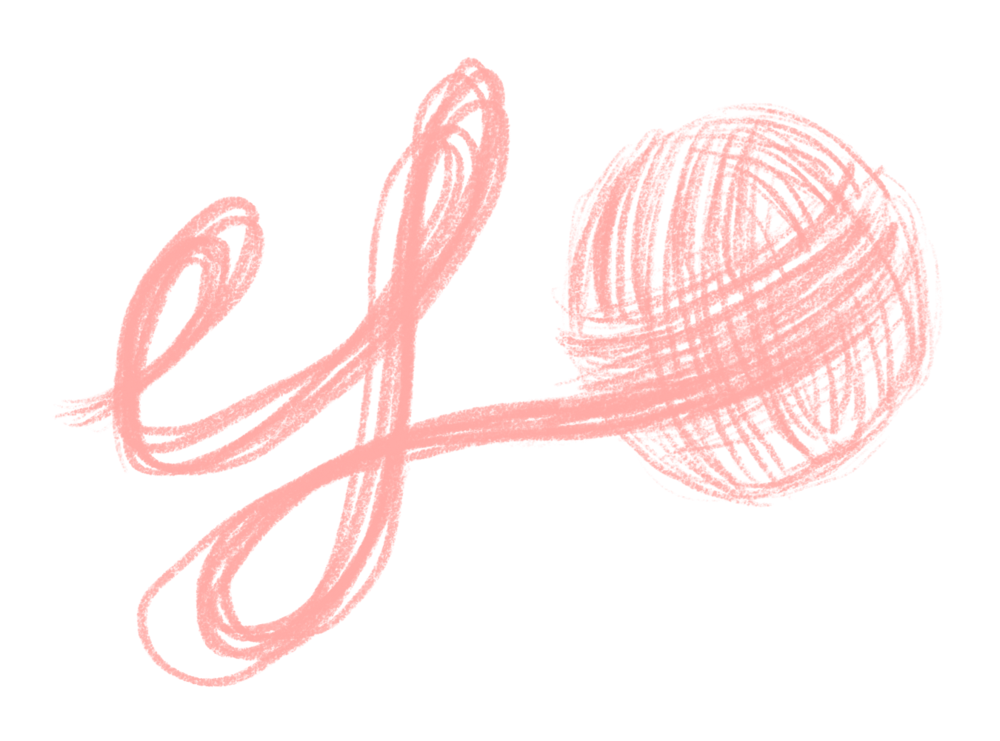
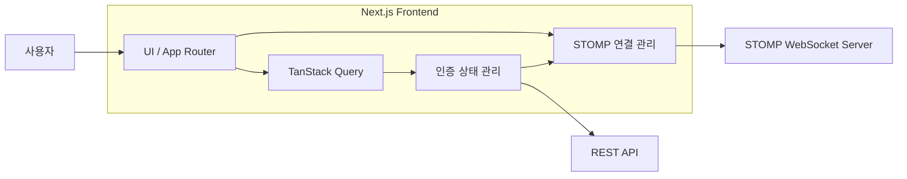

# UFO — Un-Finished Object

> 대체실 추천받고 온라인 뜨친이랑 프로젝트 완성하기

UFO는 뜨개 도안을 탐색하고, 대체 실을 추천받으며, 같은 도안을 사용하는 사용자들과 실시간으로 소통할 수 있는 뜨개 커뮤니티 서비스입니다.

* **서비스**: https://www.knit-ufo.co.kr
* **Instagram**: https://www.instagram.com/ufoknitting



---

## 프로젝트 소개

뜨개질을 하다 보면 원하는 도안을 찾거나 적절한 대체 실을 선택하고, 같은 도안을 작업하는 사람들과 정보를 나누는 과정에서 여러 불편함이 발생합니다.

UFO는 이러한 과정을 하나의 서비스 안에서 연결하여 사용자가 도안을 탐색하고, 필요한 정보를 확인하며, 다른 사용자와 작업 과정을 공유할 수 있도록 합니다.

---

## 주요 기능

### 도안 탐색

* 다양한 뜨개 도안 탐색 및 검색
* 카테고리와 조건을 이용한 도안 필터링
* 인기·신규·추천 도안 제공
* 도안 상세 정보 제공
* 관심 있는 도안 찜 및 찜 목록 관리

### 대체 실 추천

* 도안에 사용된 실 정보 제공
* 실의 특성을 기반으로 한 대체 실 탐색
* 대체 가능한 실 정보 비교

### 실시간 커뮤니티

* 도안 기반 채팅방
* STOMP WebSocket 기반 실시간 메시지 송수신
* 읽음 상태 관리
* 실시간 알림
* 연결 복구 및 메시지 동기화

### 사용자 기능

* 로그인 및 사용자 세션 관리
* 프로필 및 사용자 활동 관리
* 찜한 도안 관리
* 구매한 프로젝트 관리
* 출석체크 및 크레딧 기능

---

## 기술 스택

| 구분           | 기술                                    |
| ------------ | ------------------------------------- |
| Framework    | `Next.js` `React`                     |
| Language     | `TypeScript`                          |
| Server State | `TanStack Query`                      |
| Client State | `Zustand`                             |
| Realtime     | `STOMP WebSocket`                     |
| Styling      | `Tailwind CSS`                        |
| Mock API     | `MSW`                                 |
| Analytics    | `Vercel Analytics` `Google Analytics` |

---

## 시스템 구조



도안, 사용자, 찜 등의 일반 데이터는 REST API를 통해 관리하고, 채팅 메시지와 실시간 이벤트는 STOMP WebSocket을 통해 처리합니다.

HTTP 요청과 WebSocket 연결은 동일한 사용자 인증 상태를 기준으로 동작하도록 구성되어 있습니다.

---

## 주요 설계

### 인증 상태 관리

Access Token을 기준으로 REST API와 WebSocket의 인증 상태를 관리합니다.

* Access Token은 클라이언트 메모리에서 관리
* Refresh 요청은 하나의 Coordinator에서 관리
* 동시에 여러 인증 요청이 실패하더라도 중복 Refresh가 발생하지 않도록 처리
* Access Token 만료 시점을 기준으로 선제 갱신
* 브라우저 복귀, 포커스, 온라인 전환 시 인증 상태 재확인
* Access Token 변경 시 STOMP 연결도 최신 인증 정보를 사용하도록 재연결

이를 통해 HTTP 요청과 실시간 연결이 동일한 인증 수명주기를 공유하도록 구성했습니다.

---

### 서버 상태 관리

도안과 사용자 정보 등 서버에서 관리되는 데이터는 TanStack Query를 이용해 관리합니다.

같은 도안이 홈, 검색 결과, 상세 페이지, 찜 목록 등 여러 화면에 나타날 수 있기 때문에 상태 변경 시 관련 캐시를 함께 관리합니다.

* 즉시 반영 가능한 데이터는 Query Cache 직접 갱신
* 목록 구성이 변경될 수 있는 데이터는 invalidate 후 서버와 재동기화
* 사용자마다 값이 달라질 수 있는 데이터는 사용자 기준 Query Key를 사용

이를 통해 여러 화면에서 동일한 데이터가 일관되게 표시되도록 관리합니다.

---

### 실시간 통신

실시간 채팅은 STOMP WebSocket을 사용합니다.

STOMP Client는 애플리케이션 수준에서 관리하며, 사용자가 참여 중인 채팅방을 기준으로 Subscription을 구성합니다.

* 애플리케이션 단위 STOMP 연결 관리
* 채팅방 ID 기반 동적 Subscription
* 연결 종료 시 Subscription 상태 초기화
* 재연결 이후 필요한 채팅방 재구독
* Access Token 변경 시 WebSocket 재연결
* HTTP 메시지와 WebSocket 메시지 병합 및 중복 제거
* Optimistic Message와 서버 메시지 동기화

---

## 개발 환경

백엔드 API 개발 상태와 관계없이 프론트엔드 개발을 진행할 수 있도록 여러 실행 환경을 제공합니다.

### 기본 개발 환경

```bash
pnpm dev
```

### Mock 환경

```bash
pnpm dev:mock
```

MSW를 이용한 Mock API를 사용하며 STOMP 연결은 비활성화됩니다.

### 로컬 서버 연동

```bash
pnpm dev:local
```

로컬 REST API 및 STOMP 서버와 연동하여 실행합니다.

---

## 실행 방법

### 요구 환경

* Node.js 24
* pnpm 10

### 저장소 복제

```bash
git clone https://github.com/Un-Finished-Object/ufo-fe.git
cd ufo-fe
```

### 의존성 설치

```bash
pnpm install
```

### 개발 서버 실행

```bash
pnpm dev
```

실행 후 브라우저에서 아래 주소로 접속합니다.

```text
http://localhost:3000
```

---

## 코드 검증

변경 사항은 다음 명령어를 이용해 검증합니다.

```bash
pnpm lint
pnpm exec tsc --noEmit
pnpm build
```

---

## 디렉터리 구조

```text
src/
├── app/            # Next.js App Router 및 페이지
├── components/     # 공통 UI 컴포넌트
├── features/       # 기능 단위 모듈
│   ├── auth/       # 인증 및 사용자 상태
│   ├── chat/       # 실시간 채팅
│   ├── home/       # 홈 화면
│   ├── patterns/   # 도안 탐색·검색·상세
│   └── scraps/     # 찜 기능
├── hooks/          # 공통 React Hooks
├── lib/            # API, 인증, Query 등 공통 로직
├── mocks/          # MSW Mock API
└── proxy.ts        # API 및 인증 요청 처리
```

기능별 코드는 `features` 단위로 분리하고 여러 기능에서 함께 사용하는 공통 로직은 `lib`, `components`, `hooks`에서 관리합니다.

---

## 문서

상세한 설계 및 개발 문서는 `docs/`에서 확인할 수 있습니다.

예시:

```text
docs/
├── seo-implementation-guide.md
└── ...
```

복잡한 인증, 실시간 통신, SEO 등의 설계 내용은 README에 모두 포함하기보다 별도의 문서로 관리합니다.

---

## 협업 방식

기능 개발과 수정은 Pull Request를 기준으로 진행합니다.

주요 변경 사항은 PR에 다음 내용을 기록합니다.

* 변경 내용
* 변경 이유
* 사용자 영향
* 테스트 결과
* 관련 이슈

이를 통해 코드 변경의 목적과 검증 과정을 함께 관리합니다.

---

## 기여자

UFO는 팀 프로젝트로 개발되었습니다.

전체 기여 내역은 아래에서 확인할 수 있습니다.

* [Contributors](https://github.com/Un-Finished-Object/ufo-fe/graphs/contributors)
* [Pull Requests](https://github.com/Un-Finished-Object/ufo-fe/pulls)
